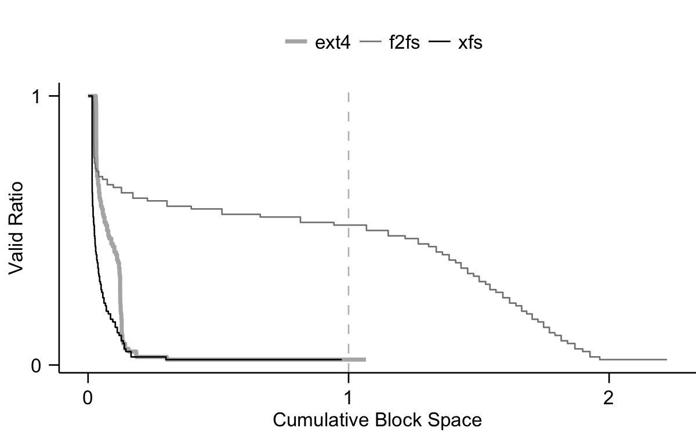

> Disclaimer: use this software at your own risk. We are not responsible for any data loss. 

> If you have any questions, please open an issue at https://github.com/junhe/wiscsee/issues. I'll be happy to help.

WiscSee is an I/O workload analyzer that helps you understand your application
performance on SSDs. WiscSee comes with a fully functioning trace-driven SSD simulator,
WiscSim, which supports enhanced versions of multiple well-known FTLs, NCQ, multiple
channels, garbage collections, wear-leveling, page allocation policies and more.
WiscSim is implemented as a Discrete-Event Simulator.

WiscSee runs your application, collects its block I/O trace, and later feeds the trace
to WiscSim.

WiscSee was developed for our paper "The Unwritten Contract of Solid State
Drives" (EuroSys'17) http://pages.cs.wisc.edu/~jhe/eurosys17-he.pdf. You may
learn more about WiscSee from the paper.

In this README file, you will learn

- How to download and setup WiscSee
- How to run helpful examples of WiscSee
- How to quickly start running your application on an SSD simulator
- How to produce zombie curves (a useful way of studying garbage collection overhead of your applications)

# Download and Setup

### Option 1: VM Image

We made a VirtualBox VM Image that has the complete environment ready (Ubuntu
16.04 + WiscSee + dependencies). You do not need to do any configuration. It is the easiest
option in terms of setting up. It is garanteed to run. But the WiscSee in the
image may be out-dated. You probably want to replace it with the latest one.

In order to use this option, you need to have VirtualBox (https://www.virtualbox.org/) installed before starting the following steps.

1. Download VirtualBox Image from the following address: 

```
http://pages.cs.wisc.edu/~jhe/wiscsee-vm.tar.gz
```

The SHA256 sum of the file is:

```
80c5f586d525e0fa54266984065b2b727f71c45de8940aafd7247d49db8e0070
```

2. Untar the downloaded file

3. Open the VM image with VirtualBox. 

This VM image may also work with other VM manager.

4. Login to the guest OS

```
Username: wsee
Password: abcabc
```

5. Run tests

```
cd /home/wsee/workdir/wiscsee
make test_all
```

The root password is:

```
abcabc
```

### Option 2: Git clone

WiscSee was developed in Ubuntu 14.04 with kernel 4.5.4. Other variants of Linux
should also work. But you may need to modify `setup.env.sh` to use different
Linux package managers.

**I strongly recommand using Ubuntu 14.04 and kernel 4.5.4 as a starting point. Other versions have known issues (from blktrace and `/proc/sys/`). If you are on Cloudlab.us, you can use profile ubuntu-14.04-linux-4.5.4, which is compatible with WiscSee.**

1. Clone

```
git clone https://github.com/junhe/wiscsee.git
```

2. Setup

```
cd wiscsee
make setup
```

`make setup` will execute `setup.env.sh`, which installs the dependencies of
WiscSee. 

3. Run tests

```
make test_all
```

# Run Examples

Running and reading the examples is a great way to learn WiscSee. The code of
the examples is in `tests/test_demo.py`. (You can also start learning WiscSee
by the Tutorial below.)

To run the examples, run the following command in the WiscSee directory.

```
make run_demo
```

The examples include:

1. Collect I/O traces of running an application on a file system. You can use R
   to directly read the refined trace file for analysis. 
2. Collect I/O traces and feed the traces to the SSD simulator with DFTLDES (DFTLDES
   is an FTL based on DFTL. It is implemented as discrete-event simulation and
   supports multiple channels, NCQ, multiple page allocation strategies, logical
   space segmentation, ...) The results show various statistis about the
   internal states of the SSD.
3. Collect I/O traces and feed the traces to the SSD simulator with NKFTL (NKFTL is
   a configurable hybrid mapping FTL based on "A reconfigurable FTL (flash
   translation layer) architecture for NAND flash-based applications" by Chanik
   Park et al.. I call it "NKFTL" because the authors name the two most
   important parameters N and K. NKFTL can be configured to act like other FTLs
   such as FAST. NKFTL is implemented as discrete-event simulation and
   supports multiple channels, NCQ, multiple page allocation strategies, ...)
4. Feed synthetic trace to the SSD simulator. This is useful if you want to test
   customized access patterns on LBA. 
5. Feed existing I/O traces to the SSD simulator. Doing so avoids running the
   application for each simulation.
6. Analyze Request Scale (request size, NCQ depth) of existing traces.
7. Run an application and analyze its request scale.
8. Analyze Locality of existing traces.
9. Analyze Aligned Sequentiality of existing traces.
10. Analyze Grouping by Death Time of existing traces. By the results, you
    will be able to plot zombie curves.
11. Analyze Uniform Data Lifetime of existing traces.


# Tutorial: Run your application with WiscSee

After walking through this tutorial, you will learn the following. 

- How to run your application with WiscSee and get results for all the rules
- Where the results are located
- What are in the results and how to interpret the results
- How to run a preparation workload before your workload

The tutorial is located here: https://github.com/junhe/wiscsee/blob/master/TUTORIAL.md

# Producing zombie curves

Zombie curve is a way of characterizing GC overhead of a workload. A zombie curve
shows the sorted valid ratios (# of valid pages in a block / # of pages in a
block) of flash blocks with live data. It looks like the one below.



Many of the examples in `tests/test_demo.py` produce data for zombie curves.
The tutorial above also teaches you how to generate data for plotting zombie
curves.  The data is stored in `recorder.json`. Here is an example.


```
    "ftl_func_valid_ratios": [
        {
            "1.00": 128
        }, 
        {
            "1.00": 240, 
            "0.91": 4, 
            "0.92": 12
        }, 
        {
            "0.69": 6, 
            "1.00": 368, 
            "0.67": 10
        }, 
        {
            "1.00": 496, 
            "0.17": 10, 
            "0.19": 6
        }, 
        ...
    ]
```

Each `{...}` is a snapshot of the valid ratio counts. For example, `"0.91": 4`
indicates that there are `4` flash blocks with valid ratio `0.91`. 

Using the data in `ftl_func_valid_ratios`, you can create an animation of how
the valid ratios change over time. 


# Notes

The simulation is written with Simpy (https://simpy.readthedocs.io/en/latest/).
You may want to learn some Simpy before modifying the core simulation code. 

# Citation

Please use the following bib to cite WiscSee:

```
@InProceedings{He17-Eurosys,
           title = "{The Unwritten Contract of Solid State Drives}",
          author = "{Jun He, Sudarsun Kannan, Andrea C. Arpaci-Dusseau, Remzi H. Arpaci-Dusseau}",
       booktitle = "EuroSys '17",
           month = "April",
            year = "2017",
         address = "Belgrade, Serbia",
}
```


